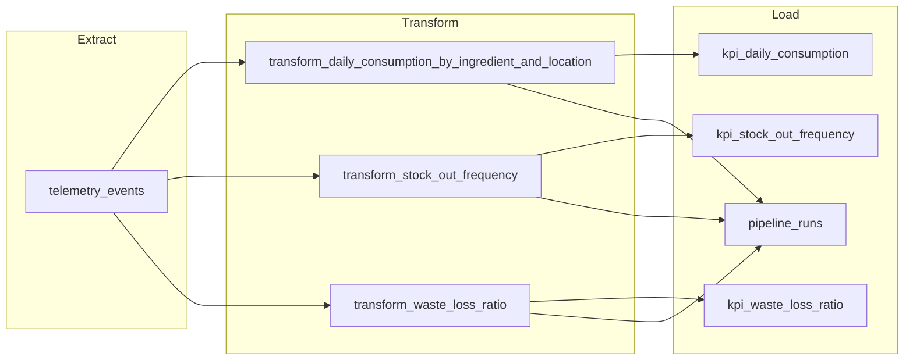

# Brasaland Telemetry KPI Pipeline — Design

**Status:** Design approved for implementation (Milestone 6) — planning only; no orchestration code in Phase 1  
**Authority:** Context 15 telemetry/KPI contracts; Milestone 5 inventory APIs unchanged  
**Phase 1 context:** `memory-bank/historical-reference/context-16-milestone-6-data-pipeline-design.md`

---

## 1. Purpose

Deliver daily, idempotent KPI tables from Brasaland backoffice telemetry so Operations (Felipe Guerrero) and leadership (Mariana Restrepo) can see consumption, stock-outs, and waste by location and act before the next service day.

---

## 2. Current state

### What we already have

| Layer | Reality today |
| ----- | ------------- |
| Capture | Inventory and backoffice events (allowlisted in `docs/telemetry/event-schemas.json`), via frontend `POST /telemetry/events` and backend `emit_event()` |
| Store | Append-only Postgres/Supabase table `telemetry_events` (`id`, `event_type`, `timestamp`, `service`, `level`, `value`, `tags`, `created_at`) |
| Report | `services/api/telemetry/analysis.py` + `GET /telemetry/report` — on-request Pandas KPIs, default last 7 days, 60s in-memory cache |

### KPI contracts (unchanged)

| KPI | Metric key | Primary events |
| --- | ---------- | -------------- |
| 1 Daily consumption by ingredient and location | `daily_consumption_by_ingredient_and_location` | `consumption_order_created` (`reason=consumption`) |
| 2 Stock-out frequency | `stock_out_frequency` | `stock_threshold_triggered` + `consumption_order_failed` (`insufficient_stock`) |
| 3 Waste and loss ratio | `waste_loss_ratio` | `consumption_order_created` (waste vs total) |

### Limitations

- No scheduled batch job; dashboards cannot rely on a durable overnight Load.
- No pipeline execution log (start/end/status/counts/errors).
- If an ad-hoc script fails mid-run, there is no audited record of partial progress.
- Recomputing via the report API does not upsert durable KPI tables, so “already processed?” is not answerable for an ETL Load phase.

### Relation to `GET /telemetry/report`

The report endpoint remains the **on-request / debug** path over raw events.  
**KPI tables** produced by this pipeline are the intended **batch / dashboard** source. This design does not require changing the report API in Milestone 6 Phase 1.

---

## 3. Folder layout

| Path | Role |
| ---- | ---- |
| `data/raw/` | Extracted windows and intermediate extract artifacts |
| `data/process/` | Reusable transformation modules used by the pipeline |
| `data/pipelines/` | Prefect entrypoints (e.g. future `pipeline.py`); pointer to this design |
| `data/eval/` | Validation outputs from optional eval/export steps |
| `docs/pipelines/PIPELINE_DESIGN.md` | This design document (canonical) |

TinyDB files under `services/api/data/` are application state, not pipeline datasets.

---

## 4. Extraction

| Item | Spec |
| ---- | ---- |
| Source | Postgres/Supabase table `telemetry_events` |
| Format | Relational rows; dimensions/measures for KPIs live mainly in `tags` (JSONB) |
| Filter | `timestamp >= period_start AND timestamp < period_end` |
| Default window | Rolling last **7 days** |
| Schedule | Daily ~**02:00** `America/Bogota` (after location close / before next service day) |
| Credentials | Prefect Block `brasaland-postgres` (backed by `DATABASE_URL`) |
| Settings | Prefect Block `brasaland-pipeline-settings` (paths, lookback days, timezone, schedule) |

---

## 5. Data flow (ETL)

Stages:

1. **Extract** — read `telemetry_events` for the run window (optional write of extract artifact under `data/raw/`).
2. **Transform** — three KPI transforms aligned to Context 15 metric definitions.
3. **Load** — upsert into the three `kpi_*` tables; insert one `pipeline_runs` row with run metadata.

---

## 6. Handling updates and duplicates

`telemetry_events` is **append-only** (no business UPDATE/DELETE).

“Updates” in this pipeline mean **recomputing the same KPI grain** when the window is processed again (late events, retries, or a second run after failure).

**Strategy:** upsert by unique key:

| Table | Unique key | Updated columns |
| ----- | ---------- | ---------------- |
| `kpi_daily_consumption` | `(date, ingredient_id, location_id)` | `quantity` |
| `kpi_stock_out_frequency` | `(date, ingredient_id, location_id)` | `stock_out_count` |
| `kpi_waste_loss_ratio` | `(date, location_id)` | `waste_quantity`, `total_quantity`, `ratio` |

Mechanism: `INSERT … ON CONFLICT (<unique key>) DO UPDATE SET …`.

---

## 7. Idempotency (second run after load failure)

Example: Load fails after upserting some KPI rows.

1. `pipeline_runs` row ends as `status=failed` with `errors` populated; `end_time` set.
2. Operator (or scheduler) re-runs `brasaland_telemetry_kpi_pipeline` for the **same** `period_start` / `period_end`.
3. Extract/transform rebuild aggregates for that window.
4. Load upserts the same grains → final KPI table contents for that window are **identical** to a single successful run (no duplicate grain rows).
5. A **new** `pipeline_runs` row is inserted for the retry (run history is append-only; KPI facts are upserted).

---

## 8. Execution log (`pipeline_runs`)

| Field | Type | Justification |
| ----- | ---- | ------------- |
| `id` | integer (PK) | Stable run identity |
| `flow_name` | string | Which flow executed |
| `period_start` | timestamptz | Window start audited |
| `period_end` | timestamptz | Window end audited |
| `start_time` | timestamptz | Run start |
| `end_time` | timestamptz | Run end / duration |
| `records_extracted` | integer | Events read from `telemetry_events` |
| `records_loaded` | integer | KPI rows upserted (sum across three tables) |
| `records_processed` | integer | Rubric alias: **same as `records_loaded`** |
| `status` | string | `running` / `completed` / `failed` |
| `errors` | text or jsonb | Failure detail for ops |

---

## 9. Prefect mapping (design only — Phase 1)

### Flows (≥2)

| Flow | Role |
| ---- | ---- |
| `brasaland_telemetry_kpi_pipeline` | Main orchestrator |
| `extract_telemetry_events_flow` | Extraction subflow |
| `transform_kpi_metrics_flow` | Transformation subflow |
| `load_kpi_tables_flow` | Load subflow |

(Optional later: `export_pipeline_eval_flow` invoked with `return_state=True` so failure does not fail the main run.)

### Tasks (≥3)

| Task | Stage |
| ---- | ----- |
| `extract_telemetry_events` | Extract |
| `transform_daily_consumption_by_ingredient_and_location` | Transform |
| `transform_stock_out_frequency` | Transform |
| `transform_waste_loss_ratio` | Transform |
| `load_kpi_tables` | Load |
| `record_pipeline_run` | Audit |

### States

`Running`, `Completed`, `Failed` — recorded on the flow run and mirrored in `pipeline_runs.status`.

### Blocks

| Block | Contents |
| ----- | -------- |
| `brasaland-postgres` | SQL connection from `DATABASE_URL` |
| `brasaland-pipeline-settings` | `data/raw`, `data/process`, `data/eval` paths; lookback=7; timezone=`America/Bogota`; daily ~02:00 |

---

## 10. Intended schedule and run command

| Item | Spec |
| ---- | ---- |
| Schedule | Daily ~02:00 `America/Bogota` |
| Lookback | Rolling 7 days per run |
| CLI (Phase 2+) | `python data/pipelines/pipeline.py` |

> Phase 1 delivers this design only. The CLI and Prefect implementation are Milestone 6 Phase 2+.

---

## 11. Consistency checklist

- [x] Source = `telemetry_events` (Context 15 storage)
- [x] KPI names/grains match Context 15 report metrics
- [x] Raw events remain append-only
- [x] Load idempotency via upsert-by-grain
- [x] Run audit fields ≥5 with types and justifications
- [x] Prefect flows/tasks named for Phase 2/3 without rename churn
