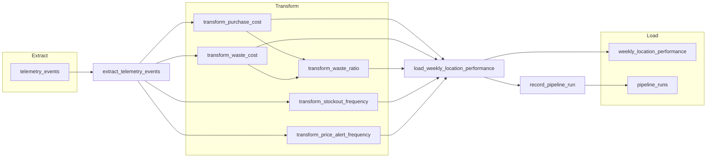

# Brasaland Weekly Location Cost & Waste Pipeline — Design

**Status:** Design locked for Milestone 6 implementation (Phases 1–3)  
**Authority:** Course telemetry floor (`schemaVersion` 2); Milestone 5 inventory APIs unchanged  
**Decision log:** Locked pipeline decisions P1–P11 (session)  
**Phase contexts:**
- `context-16-milestone-6-data-pipeline-design.md` (Phase 1 — design)
- `context-16-milestone-6-resilient-data-pipeline.md` (Phase 2 — implement)
- `context-16-milestone-6-pipeline-subflows-tests.md` (Phase 3 — subflows, tests, dashboard)

---

## 1. Purpose

Deliver Mariana Restrepo (CEO) and Felipe Guerrero (Operations) a **weekly, per-location, per-country rollup of purchase cost, waste cost, waste ratio, stockout frequency, and price-alert frequency** — the Weekly Location Cost & Waste Report — from Brasaland course-floor telemetry, without changing `telemetry_events` or `GET /telemetry/report`.

---

## 2. Locked decisions (summary)

| ID | Lock |
| -- | ---- |
| P1 | Destination table `reporting.weekly_location_performance`, unique `(location_id, week_start)` |
| P2 | APIs in `services/api/reporting/` (separate from `telemetry/`) |
| P3 | `location_id` integer 1–14 |
| P4 | ISO week grain (`week_start` = Monday UTC); nightly recompute ~02:00 `America/Bogota` |
| P5 | Waste `unit_cost` on `stock_waste_registered`; waste cost = `quantity × unit_cost` |
| P6 | Missing `unit_cost` → exclude from cost sums; log skip counts |
| P7 | Do not modify `services/api/telemetry/analysis.py` or `GET /telemetry/report` |
| P8 | Three phase contexts + this shared design doc |
| P9 | Prefect vocabulary below |
| P10 | Capture-layer RFP questions answered here; not implemented in Milestone 6 code |
| P11 | Run audit table `reporting.pipeline_runs` |

### Phase 2 implementation locks (session)

| # | Lock |
| - | ---- |
| L1 | Lookback **2 weeks** (open + previous ISO week) |
| L2 | **Sparse** grains — only locations with activity in the week |
| L3 | Schema via SQL `ensure_reporting_schema` (no Alembic required) |
| L4 | `POST /reporting/pipeline-runs` → **202** + background task |
| L5 | Prefect dependency in **`services/api`** (`prefect>=3`); entry `data/pipelines/pipeline.py` |
| L6 | No concurrency / single-flight lock (upsert is enough) |
| L7 | Reporting endpoints authenticated like inventory (JWT) |

---

## 3. KPIs (must match context § KPIs to Measure)

| KPI | Field | Computation |
| --- | ----- | ----------- |
| Purchase Cost per Location | `total_purchase_cost` | Sum `quantity × unit_cost` over `inbound_order_created` in week (same currency), excluding missing `unit_cost` |
| Waste Cost per Location | `total_waste_cost` | Sum `quantity × unit_cost` over `stock_waste_registered` in week, excluding missing `unit_cost` |
| Waste Ratio | `waste_ratio` | `total_waste_cost / total_purchase_cost` (0 if no purchases) |
| Stockout Frequency | `stockout_events_count` | Count of `stock_threshold_triggered` in week |
| Price Alert Frequency | `price_alert_events_count` | Count of `ingredient_price_variance_detected` in week |

**Grain:** one row per `(location_id, week_start)` with `country`, `currency` (`COP`/`USD`). **No FX conversion.**

**Context only (not KPIs):** `outbound_order_created` may be used for anomaly / silence checks, not for the five KPI columns.

---

## 4. Current state analysis

### Already captured

| Layer | Reality |
| ----- | ------- |
| Events | Course-floor inventory events in `docs/telemetry/event-schemas.json` (`schemaVersion` 2), including `inbound_order_created`, `outbound_order_created`, `stock_waste_registered`, `stock_threshold_triggered`, `ingredient_price_variance_detected` |
| Store | Append-only Postgres/Supabase `telemetry_events` |
| Report | `GET /telemetry/report` + Pandas quantity KPIs (daily consumption, stock-out, waste quantity ratio) — **technical / on-request** |

### Gap this pipeline fills

`GET /telemetry/report` does **not** produce Mariana’s weekly monetary purchase/waste rollup, price-alert counts, or a durable reporting table for the backoffice dashboard. That unanswered business question is exactly the Weekly Location Cost & Waste Report.

---

## 5. Extraction

| Item | Spec |
| ---- | ---- |
| Source | `telemetry_events` (read-only) |
| Filter | `event_type` ∈ source list; `timestamp` in extract window covering week(s) being recomputed |
| Format | Relational rows; measures/dimensions in `tags` JSONB (`location_id`, `country`, `currency`, `quantity`, `unit_cost`, …) |
| Cadence | Nightly ~02:00 `America/Bogota`; each run upserts **2** ISO weeks (open + previous) |
| Blocks | `brasaland-postgres`, `brasaland-pipeline-settings` (see `data/pipelines/blocks.py`; env fallback for local CLI) |
| Grain write | **Sparse** — upsert only `(location_id, week_start)` with activity |
| Schedule cron | `0 2 * * *` in timezone `America/Bogota` (`NIGHTLY_CRON_BOGOTA`) |

---

## 6. Data flow (ETL)



Stages:

1. **Extract** — read `telemetry_events` for the window (optional artifact under `data/raw/`).
2. **Transform** — five KPI transforms aligned to §3 (reusable modules under `data/process/`).
3. **Load** — upsert `reporting.weekly_location_performance`; insert `reporting.pipeline_runs`.

---

## 7. Destination tables (`reporting` schema)

### `reporting.weekly_location_performance`

```sql
create schema if not exists reporting;

create table if not exists reporting.weekly_location_performance (
  id uuid primary key default gen_random_uuid(),
  location_id integer not null check (location_id between 1 and 14),
  country text not null check (country in ('CO', 'US')),
  week_start date not null,
  total_purchase_cost numeric not null default 0,
  total_waste_cost numeric not null default 0,
  waste_ratio numeric not null default 0,
  stockout_events_count integer not null default 0,
  price_alert_events_count integer not null default 0,
  currency text not null check (currency in ('COP', 'USD')),
  computed_at timestamptz not null default now(),
  unique (location_id, week_start)
);
```

> Eval text that says `reporting.business_metrics` maps to this **reporting schema metrics table**. Canonical table name is `weekly_location_performance`.

### `reporting.pipeline_runs`

| Field | Type | Justification |
| ----- | ---- | ------------- |
| `id` | uuid / int PK | Run identity |
| `flow_name` | text | Which flow executed |
| `week_start` | date | Primary week grain audited (nullable if multi-week) |
| `period_start` / `period_end` | timestamptz | Extract window |
| `start_time` | timestamptz | Run start |
| `end_time` | timestamptz | Run end |
| `records_extracted` | int | Events read |
| `records_loaded` | int | KPI rows upserted |
| `records_processed` | int | Alias of `records_loaded` for rubric |
| `records_skipped_missing_cost` | int | Defensive skip count (P6) |
| `status` | text | `running` / `completed` / `failed` |
| `errors` | text/jsonb | Failure detail |

---

## 8. Updates, duplicates, idempotency

`telemetry_events` remains **append-only** (pipeline never writes it).

**Load strategy:** `INSERT … ON CONFLICT (location_id, week_start) DO UPDATE` of KPI columns + `computed_at`.

**Second run after load failure:** same week window → same upsert grains → identical table contents for that week; a **new** `pipeline_runs` row records the retry.

**Late events:** nightly recompute of recent week(s) refreshes aggregates without duplicate grains.

---

## 9. Resilience (Phase 2)

- Retries + `retry_delay_seconds` on tasks that hit Postgres / network.
- Optional eval/export/notify subflow/task invoked with `return_state=True` so failure does not fail the main run.
- Cache (`cache_key_fn`, `cache_expiration`) on at least one expensive transform (key includes `week_start` + extract fingerprint or period bounds; TTL ≤ 1 hour per ticket).

---

## 10. Prefect vocabulary (locked — P9)

### Flows

| Flow | Role |
| ---- | ---- |
| `brasaland_weekly_location_performance_pipeline` | Main orchestrator |
| `extract_telemetry_events_flow` | Extraction subflow |
| `transform_weekly_location_performance_flow` | Transformation subflow |
| `load_weekly_location_performance_flow` | Load subflow |
| `export_pipeline_eval_flow` | Optional; `return_state=True` from main |

### Tasks

| Task | Stage |
| ---- | ----- |
| `extract_telemetry_events` | Extract |
| `transform_purchase_cost` | Transform |
| `transform_waste_cost` | Transform |
| `transform_waste_ratio` | Transform |
| `transform_stockout_frequency` | Transform |
| `transform_price_alert_frequency` | Transform |
| `load_weekly_location_performance` | Load |
| `record_pipeline_run` | Audit |

### States

`Running`, `Completed`, `Failed` — mirrored on `pipeline_runs.status`.

### Blocks

`brasaland-postgres`, `brasaland-pipeline-settings`.

---

## 11. Application integration (design → Phase 2+)

| Endpoint | Behavior | Imports from |
| -------- | -------- | ------------ |
| `GET /reporting/weekly-location-performance` | Optional `week_start`; default latest computed week; sparse location rows | Query helpers / read models — **no ETL in services** |
| `GET /reporting/pipeline-runs/latest` | Last run metadata | `reporting.repository` |
| `POST /reporting/pipeline-runs` | Manual trigger → **202 Accepted**, background Prefect run | `reporting.runner` |

Module: `services/api/reporting/`. Auth: same JWT conventions as inventory.

Phase 3 dashboard: `uis/backoffice` `/reporting` — table + week selector + last-run status + Run pipeline button (D1–D4); nav label **Reporting**.

---

## 12. Folder layout

| Path | Role |
| ---- | ---- |
| `data/raw/` | Extract artifacts |
| `data/process/` | Reusable transforms (unit-tested) |
| `data/pipelines/` | `pipeline.py` + orchestration; this design pointer |
| `data/eval/` | Validation / optional export outputs |
| `docs/pipelines/PIPELINE_DESIGN.md` | Canonical design (this file) |

---

## 13. Capture-layer RFP answers (document only — P10)

| Question | Design answer (not Milestone 6 implementation) |
| -------- | ----------------------------------------------- |
| Duplicate source emits / same `eventId` | Prefer unique `eventId` at ingest + upsert; separate capture hardening ticket |
| Re-run after load failure | Upsert by `(location_id, week_start)` (implemented in pipeline) |
| Late events | Nightly recompute window + new `pipeline_runs` row |
| Silence vs zero activity | Heartbeat / location-reporting checks (future observability) |
| Concurrent cron + manual | Window lock / single-flight by week (Phase 2 optional) |
| Client buffer / Idempotency-Key | Frontend + ingest ticket; server dedupe by `eventId` |

---

## 14. Schedule and run command

| Item | Spec |
| ---- | ---- |
| Schedule | Nightly ~**02:00** `America/Bogota` — cron `0 2 * * *` (`NIGHTLY_CRON_BOGOTA` / settings.schedule_cron) |
| Grain | ISO week; `week_start` = Monday UTC |
| CLI | From `services/api`: `uv run python ../../data/pipelines/pipeline.py` |
| Blocks (optional register) | `uv run python -c "from data.pipelines.blocks import save_default_blocks; save_default_blocks()"` |

> Phase 1 delivers this design. Phase 2 implements Prefect + CLI + reporting API. Phase 3 adds subflows, `tests/pipelines/test_pipeline.py`, and backoffice dashboard.

---

## 15. Consistency checklist

- [x] Source = read-only `telemetry_events`
- [x] Five KPIs from course pipeline context
- [x] Event names = course floor (`inbound_order_created`, `stock_waste_registered`, …)
- [x] Destination = `reporting.weekly_location_performance`
- [x] Upsert idempotency on `(location_id, week_start)`
- [x] `pipeline_runs` audit ≥5 fields
- [x] Reporting APIs separate from `/telemetry/report`
- [x] Prefect names locked for Phases 2–3
- [x] No FX mixing in a single row

## 16. Phase 2 operator verification

- [x] Live CLI run succeeds with `DATABASE_URL`
- [x] Repeat CLI run upserts same grain (no duplicate `(location_id, week_start)` rows)
- [x] Acceptance criteria in `context-16-milestone-6-resilient-data-pipeline.md` marked complete

## 17. Phase 3 locks (D1–D6)

| ID | Lock |
| -- | ---- |
| D1 | Table + week selector + last-run status |
| D2 | Run pipeline button → `POST /reporting/pipeline-runs` |
| D3 | Nav **Reporting** → `/reporting` |
| D4 | Sparse + empty-state copy; show country/currency |
| D5 | `services/api/tests/pipelines/test_pipeline.py` |
| D6 | Thin extract/transform/load subflows around existing tasks |
