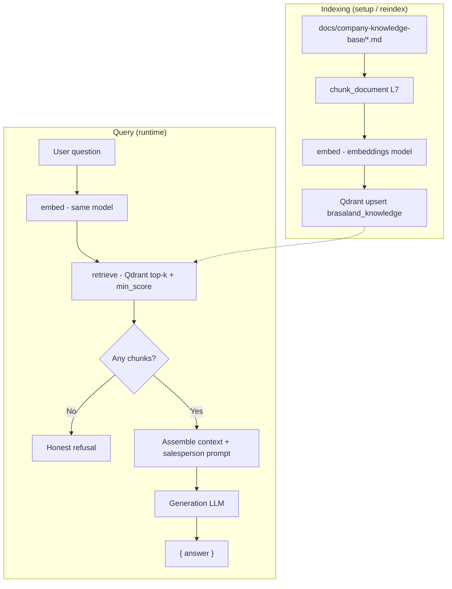

# Brasaland RAG Knowledge Assistant — Design

**Status:** Implemented (Milestone 7 / context-21)  
**Authority:** `memory-bank/historical-reference/context-21-rag-knowledge-base.md` (L1–L13)  
**Corpus:** `docs/company-knowledge-base/*.en.md`  
**Eval set:** `data/eval/test-queries.json`

---

## 1. Purpose

Give Brasaland commercial and operations staff a **salesperson-voiced** assistant that answers natural-language questions from official internal manuals — without returning raw vector-search results to the user.

The API and backoffice UI call a single orchestration function (`query()`). Indexing, embedding, and retrieval live in separate modules so any layer can be swapped independently.

---

## 2. RAG process (end-to-end)

### Numbered flow

1. **Corpus load** — `setup()` resolves the knowledge-base directory (L9) and reads the four `.en.md` source files.
2. **Chunking** — Each document is split into semantic sections (L7); every chunk gets metadata (`source_document`, `section`, `chunk_index`, `text`).
3. **Embedding (index time)** — `embed()` calls the **embeddings model only** and produces a fixed-size vector per chunk.
4. **Upsert** — Vectors and payloads are upserted into Qdrant collection `brasaland_knowledge` with deterministic UUID5 point IDs (L2, L13).
5. **Query (runtime)** — User question arrives at `POST /knowledge/query` (authenticated).
6. **Embed (query time)** — The same `embed()` function vectorizes the question (same model as indexing).
7. **Retrieve** — `retrieve()` searches Qdrant top-`k`, applies `min_score`, returns payload dicts + internal `score` (never exposed to the client).
8. **Empty check** — If no chunk clears the threshold, return an honest refusal (S5) without calling the generation model.
9. **Prompt assembly** — Retrieved chunk bodies are formatted with source/section labels; the salesperson system prompt and business constraints are applied (S6).
10. **Generate** — The **generation model** (distinct from embeddings, L8) produces the final answer string.
11. **Respond** — HTTP/UI return `{ "answer": "..." }` only (L10, S8).

Reindex (`POST /knowledge/reindex` or CLI) repeats steps 1–4 only; it does not change retrieval or generation logic.

### Flow diagram

### Module map

| Step | Function | Module |
| ---- | -------- | ------ |
| 1–4 | `setup()`, `embed()` | `data/process/rag.py` |
| 6–10 | `retrieve()`, `query()` | `data/pipelines/rag.py` |
| 5, 11 | HTTP routes | `services/api/knowledge/` |
| UI | Ask / reindex | `uis/backoffice/app/knowledge/` |

---

## 3. Chunking strategy (L7)

### Why this approach fits the Brasaland corpus

The four manuals are short, operations-focused Markdown files. They mix:

- **Flat prose** with labeled sections (`Program tiers:`, `Daily procedure:`) rather than consistent `##` headings.
- **Bullet lists** (tiers, dishes, supplier categories) that must stay intact for faithful answers.
- **Procedural steps** (allergen protocol, waste logging) where mid-sentence splits would break meaning.

Chunking therefore uses a **two-pass strategy**:

1. **Primary split** — `##` / `###` headings when present; otherwise regex on known Brasaland section labels (`Program tiers`, `Main dishes and their declared allergens`, etc.).
2. **Length guard** — Sections over **~1000 characters** (`MAX_SECTION_CHARS`) are split on blank-line paragraph boundaries, never mid-sentence.
3. **Minimum density** — `_ensure_min_chunks()` guarantees **≥ 3 chunks per document** by splitting the largest chunk on paragraphs or line groups if a doc would otherwise be under-segmented.

No LangChain or external chunkers (S1). Overlap is minimal — only what falls out of paragraph grouping when a long section is split.

### Observed chunk counts (current corpus)

Measured with `load_corpus_chunks()` (dry-run, no embeddings):

| Source document | Chunks | Approx. body size per chunk |
| --------------- | ------ | ----------------------------- |
| `loyalty-program` | 3 | 222–678 chars |
| `menu-allergens` | 3 | 249–424 chars |
| `supplier-ordering` | 3 | 122–389 chars |
| `waste-protocol` | 5 | 148–337 chars |
| **Total indexed** | **14** | — |

Example section labels after chunking:

- Loyalty: `"Brasa Points" Loyalty Program`, `Program tiers`, `Frequently asked customer questions`
- Allergens: intro, `Main dishes and their declared allergens`, `Protocol for customer-reported allergies`
- Waste: intro, `Daily procedure`, escalation blocks, `Operational target`
- Supplier: intro, `Supplier categories and order frequency`, `Minimum stock rule`

This granularity keeps tier tables, allergen lines, and procedure steps in coherent units for Recall@3 evals.

---

## 4. Embedding and retrieval practices

### Two models, two clients (L8)

| Role | Env vars | Used by |
| ---- | -------- | ------- |
| Embeddings | `EMBEDDING_BASE_URL`, `EMBEDDING_API_KEY`, `EMBEDDING_MODEL_ID` | `embed()` in `data/process/rag.py` |
| Generation | `GENERATION_BASE_URL`, `GENERATION_API_KEY`, `GENERATION_MODEL_ID` | `query()` in `data/pipelines/rag.py` |

Startup asserts `EMBEDDING_MODEL_ID != GENERATION_MODEL_ID`. Thin OpenAI-compatible wrappers (`embed_client()`, `generation_client()`) keep responsibilities separate.

**Deployed values (4Geeks student portal — subject to portal updates):**

| Setting | Example value |
| ------- | ------------- |
| Embeddings model | `downtown-miami/openrouter/perplexity/pplx-embed-v1-0.6b` |
| Generation model | `downtown-miami/openrouter/deepseek/deepseek-v4-flash` |
| Vector dimension | **1024** (from first `embed()` call at setup time) |
| Distance metric | **Cosine** (`qmodels.Distance.COSINE`) |

Fill URLs and keys from the current 4Geeks portal; do not hard-code secrets in the repo.

### Same `embed()` at index and query time

Both `setup()` and `retrieve()` call the identical `embed(text)` function. That keeps query vectors in the same space as indexed chunks — a requirement for meaningful cosine similarity.

### Preprocessing

- **Input trim** — Leading/trailing whitespace stripped before embedding (`text.strip()`).
- **No stemming or lowercasing** — Manual wording (allergen names, COP/USD amounts, tier names) must survive unchanged.
- **No query expansion** — Single embedding per question; no HyDE or multi-query retrieval in this milestone.

### Retrieval parameters

| Parameter | Default | Env override | Notes |
| --------- | ------- | ------------ | ----- |
| `k` | 5 | `RAG_TOP_K` | Max hits requested from Qdrant |
| `min_score` | **0.30** | `RAG_MIN_SCORE` | Cosine threshold (L6, frozen) |
| Collection | `brasaland_knowledge` | `QDRANT_COLLECTION` | — |

### Why `min_score = 0.30`

Initial threshold **0.55** was too strict for `pplx-embed-v1-0.6b` on this small corpus: on-topic hits scored ~**0.32–0.65**, off-topic ~**0.06**. At 0.55, valid loyalty/allergen questions often returned zero chunks and triggered refusals.

**0.30** retains off-topic separation while allowing true matches into the prompt. Change only with eval evidence from `data/eval/test-queries.json` and update this section.

`retrieve()` passes `score_threshold` to Qdrant **and** filters in Python so sub-threshold hits never reach generation.

### Point identity (L13)

Point IDs are UUID5 over `f"{source_document}:{chunk_index}"` with a fixed namespace. Re-running `setup()` upserts the same IDs — idempotent refresh without duplicate points.

---

## 5. Generation prompt and business rules

The system prompt enforces:

- **Salesperson voice** — confident, helpful, commercial tone (ticket brief).
- **Grounding only** — no invented policies, prices, or allergens.
- **Allergen safety** — never guarantee “zero risk” of cross-contamination (matches `brasaland-menu-allergens.en.md`).
- **Currency fidelity** — USD and COP amounts copied exactly; no auto-conversion (§6).
- **No retrieval leakage** — do not mention chunks, scores, or vector search to the end user.

Temperature **0.2** for stable, factual phrasing.

---

## 6. HTTP surface and operations

| Method / path | Auth | Behavior |
| ------------- | ---- | -------- |
| `POST /knowledge/query` | JWT required | `{ question }` → `{ answer }` |
| `POST /knowledge/reindex` | JWT required | Upsert-only `setup()` → `{ status, chunks_indexed }` |

- **CLI indexing:** `uv run python -m data.process.rag` (primary path for collection recreate on dim/metric change).
- **UI reindex:** Confirm modal — user must type `REINDEX`; upsert only, no collection wipe button.

---

## 7. Evaluation

### Metrics (context §4)

| KPI | Target |
| --- | ------ |
| Recall@3 | ≥ 80% of eval questions have the correct `source_document` in top-3 retrieved chunks |
| Faithfulness | Generated answer must not introduce numbers (%, amounts, kg) absent from retrieved chunks |
| Threshold behavior | Below `min_score` → honest refusal, not hallucination |

### Eval file

`data/eval/test-queries.json` — ≥ 8 questions covering all four `source_document` values, including required seeds (Gold tier points, BBQ Ribs allergens) and at least one case that must **not** answer “zero risk” on allergens.

Run retrieval evals manually or via a future script; generation faithfulness is reviewed against `expected_answer_notes`.

### Automated tests

`services/api/tests/pipelines/test_rag.py` — mocked Qdrant + generation LLM (Phase 5).  
`services/api/tests/test_knowledge_api.py` — HTTP wiring with mocked pipeline.

---

## 8. Explicit non-goals

- Conversational memory / chat history in Qdrant
- LangChain, LlamaIndex, or agent frameworks
- Returning chunks, scores, or raw Qdrant payloads to clients
- Public unauthenticated query endpoints
- Auto COP ↔ USD conversion
- Celery / Prefect integration for query or reindex

---

## 9. References

- Context lock: `memory-bank/historical-reference/context-21-rag-knowledge-base.md`
- Indexing: `data/process/rag.py`
- Pipeline: `data/pipelines/rag.py`
- API: `services/api/knowledge/routes.py`
- UI: `uis/backoffice/app/knowledge/page.tsx`
