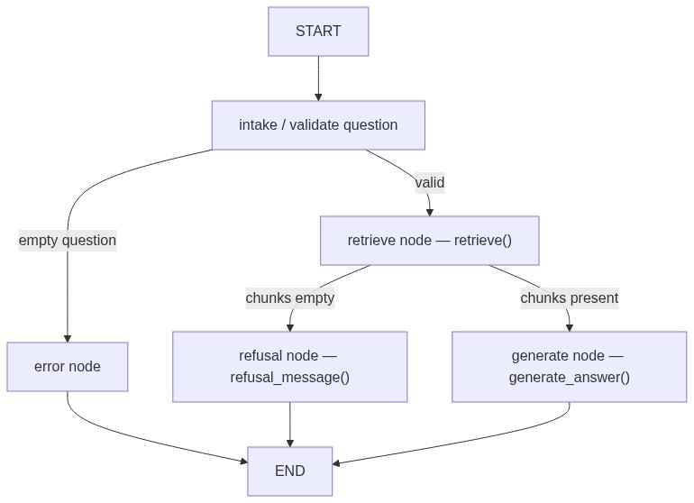
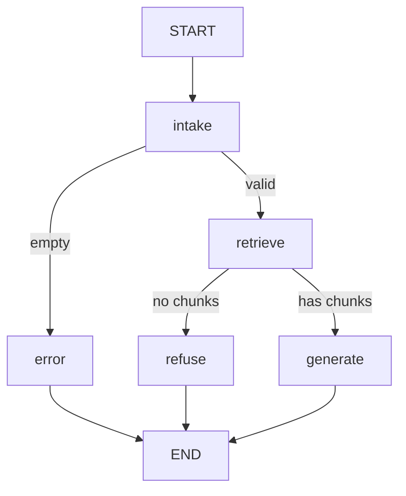

# Context 23 — Support Agent with LangGraph (Part 1)

**Ticket:** Support agent — migrate RAG to an explicit LangGraph (graph, trace, checkpointing)  
**Type:** LangGraph orchestration + FastAPI `/agent` + backoffice Support UI + tests  
**Branch:** `support-agent-with-langgraph`  
**Status:** ✅ Implemented on branch `support-agent-with-langgraph`  
**Depends on:** context-21 (RAG pipeline + `/knowledge`), context-22 (routing alignment)  
**Companion (Part 2 — next branch):** [context-23-support-agent-langgraph-p2.md](./context-23-support-agent-langgraph-p2.md) — live incident/inventory tools + routing (**not Part 1 scope**)  
**Stakeholders:** Nicolás Park (tech lead); Brasaland Digital / operations support users

---

## Ticket brief (Part 1)

Before adding external tools (Part 2), the reasoning flow must become an **explicit graph**: state, single-responsibility nodes, conditional edges, compilation before execution, checkpointing, and a **queryable trace** for every run.

Tech lead note:

> I don't want you to rewrite the RAG logic from scratch — the `retrieve` and `embed` you already have work fine. What I want is that same behavior living inside a LangGraph graph, with single-responsibility nodes, and every run traced. If I can't see why the agent answered what it answered, I can't trust it in production.

### Core acceptance criteria (non-negotiable)

1. **Graph compiled before execution** — structural errors fail at build time.
2. **Minimal explicit state** — not full conversation history in Part 1.
3. **Queryable trace** every run — which nodes ran, in order, with summaries (not only stdout).
4. **Separate retrieve and generate nodes** — never call monolithic `query()` inside a single node (that re-runs retrieval).
5. **Grounding preserved** — answers stay faithful to the existing RAG knowledge base; existing RAG tests remain an acceptance gate.
6. **Thin HTTP** — `POST /agent/query` invokes the graph only; no duplicated business logic in the route.

### Node contract (critical)

| Node | Calls | Must not |
| ---- | ----- | -------- |
| `retrieve` | `retrieve()` from `data/pipelines/rag.py` | Call `query()` |
| `generate` | `generate_answer(question, context)` | Call `retrieve()` again |
| `refuse` | `refusal_message()` | Invent new refusal copy |
| `intake` / `error` | Validation only | Hit Qdrant or LLM |

`query()` remains the **Knowledge** entry point only — a thin wrapper over `retrieve()` + `generate_answer()` for backward compatibility.

---

## Goal (Part 1)

Deliver a traceable Support Agent for backoffice users:

1. **LangGraph** orchestrates intake → retrieve → generate (or refuse / error) with conditional edges.
2. **`POST /agent/query`** returns `{ "answer" }` only — same client shape as Knowledge, different engine.
3. **`/support` backoffice page** calls `/api/agent/query` (new tab; Knowledge tab unchanged).
4. **SQLite checkpointing** + structured `trace_events` for inspect/eval.
5. **≥3 mocked evals** in `services/api/tests/pipelines/test_support_agent_graph.py`.

**Golden rules**

- Reuse RAG from context-21 — do not reimplement embed/search/generation in the graph.
- **Coexist** with `/knowledge/query` — do not replace or redirect the Knowledge UI in Part 1.
- LangGraph is allowed for **orchestration only** (see Authority below).
- Package installs: **`cd services/api && uv add …` only**.

---

## Authority / supersession

| Source | Rule |
| ------ | ---- |
| context-21 **S1** (no agent frameworks) | **Superseded for Part 1 only** — LangGraph permitted for `/agent` graph layer |
| context-21 RAG functions | **Still authoritative** — `setup`, `embed`, `retrieve`, `generate_answer`, `query` |
| context-21 **S8** | HTTP/UI return `{ "answer" }` only — never chunks, scores, or trace |
| context-22 | **Routing alignment guideline** — bare FastAPI mounts + backoffice `/api/<domain>` proxy |

LangChain chains, LlamaIndex, and Haystack remain **banned** for RAG. A transitive `langchain-core` dependency from `langgraph` is acceptable if no LangChain orchestration wraps RAG.

---

## Knowledge vs Support Agent (two products, one corpus)

| | **Knowledge** (context-21, exists) | **Support Agent** (Part 1, new) |
| -- | -------------------------------- | ------------------------------- |
| **UI** | `/knowledge` tab | `/support` tab |
| **Browser API** | `POST /api/knowledge/query` | `POST /api/agent/query` |
| **FastAPI** | `POST /knowledge/query` | `POST /agent/query` |
| **Engine** | `query()` — single orchestrator | LangGraph — explicit nodes + trace |
| **Reindex** | Yes (`/knowledge/reindex`) | No (indexing stays on Knowledge) |
| **Part 2 tools** | No | Added in companion P2 doc (next branch) |

---

## Function signatures (locked — Phase 0 refactor)

Update `data/pipelines/rag.py` **before** graph work:

```python
def assemble_context(chunks: list[dict]) -> str: ...
def refusal_message() -> str: ...
def generate_answer(question: str, context: str) -> str: ...
def retrieve(query: str, *, k: int = 5, min_score: float | None = None) -> list[dict]: ...
def query(question: str) -> str:
    """Backward-compatible wrapper for POST /knowledge/query only."""
```

- `generate_answer()` uses existing `SYSTEM_PROMPT`, `generation_client()`, temperature `0.2` — **same salesperson voice as Knowledge** (Part 1 is migration, not persona change).
- `generate_answer()` must **not** call `retrieve()`.
- Export helpers currently private as `_assemble_context` / `_refusal_message`.

---

## Locked decisions (P1-L1–P1-L13)

| ID | Topic | Locked choice |
| -- | ----- | ------------- |
| **P1-L1** | Framework | **LangGraph** for graph compile/invoke/checkpoint only |
| **P1-L2** | RAG reuse | Nodes import `retrieve`, `generate_answer`, `refusal_message`, `assemble_context` from `data/pipelines/rag.py` |
| **P1-L3** | Monolithic `query()` in graph | **Forbidden** in any single node |
| **P1-L4** | Endpoint | `POST /agent/query` — `{ "question" }` → `{ "answer" }` |
| **P1-L5** | Coexist Knowledge | Keep `POST /knowledge/query` → `query()`; do not remove or redirect |
| **P1-L6** | Auth | All `/agent/*` routes — `Depends(get_current_user)` |
| **P1-L7** | HTTP errors | 400 empty question; 502 friendly message; **never** raw stack trace to client |
| **P1-L8** | Client response | `{ "answer" }` only — no `thread_id`, trace, chunks, or scores |
| **P1-L9** | Checkpointer | **SQLite** — default `data/agent/checkpoints.db` (`AGENT_CHECKPOINT_DB_PATH`) |
| **P1-L10** | Trace | `trace_events` in state + checkpointer; LangSmith optional |
| **P1-L11** | Imports | Reuse `knowledge.bootstrap.ensure_repo_root_on_path()` before `data.pipelines.rag` imports |
| **P1-L12** | Execution | Sync `graph.invoke()` — no Celery |
| **P1-L13** | Tests path | `services/api/tests/pipelines/test_support_agent_graph.py` |

### Routing alignment (extends context-22)

| Layer | Path |
| ----- | ---- |
| Backoffice **page** | `/support` (tab label: **Support Agent**) |
| FastAPI **mount** | `/agent` |
| Browser **API** | `/api/agent/query` |
| FastAPI **must not** use | `/api/agent` as Python mount (violates bare-mount convention) |

Optional env: `NEXT_PUBLIC_AGENT_API_BASE_URL` — direct FastAPI origin bypasses Next proxy (mirror Knowledge).

---

## Graph state schema (Part 1 — minimal)

```python
question: str
chunks: list[dict]           # retrieve output (payload + score)
context_text: str           # assemble_context(chunks) or ""
answer: str
route: str                  # e.g. retrieve | refuse | error | generate
error: str | None
trace_events: list[dict]    # append-only per node
```

**Part 1 does not include:** `messages[]` chat history, `thread_id` in HTTP, or Part 2 fields (`intent`, `sources_used`, `tool_results`) — those are reserved for P2 companion doc.

Each node appends to `trace_events`, e.g.:

```json
{"node": "retrieve", "chunk_count": 2, "min_score": 0.30}
```

---

## Graph nodes and conditional edges

### Nodes

| Node | Responsibility |
| ---- | -------------- |
| `intake` | Trim/validate `question` |
| `retrieve` | `chunks = retrieve(question)` |
| `generate` | `answer = generate_answer(question, assemble_context(chunks))` |
| `refuse` | `answer = refusal_message()` when no chunks |
| `error` | Empty/whitespace question — set error answer |

### Edges (not a fixed line)

```text
START → intake
intake → error          if question empty
intake → retrieve       if question valid
retrieve → refuse       if chunks == []
retrieve → generate     if chunks non-empty
error / refuse / generate → END
```

### Flow diagram



<details>
<summary>Mermaid source</summary>



</details>

### Compilation

- Build graph, then **`graph.compile(checkpointer=...)`** before any invoke.
- Compilation must fail clearly on structural errors (disconnected node, invalid state keys).

---

## Suggested file layout

| Responsibility | Location |
| -------------- | -------- |
| Graph state | `services/api/agent/state.py` |
| Graph + nodes | `services/api/agent/graph.py` |
| HTTP routes | `services/api/agent/routes.py` |
| Bootstrap | Reuse `knowledge/bootstrap.py` (`ensure_repo_root_on_path`) |
| RAG primitives | `data/pipelines/rag.py` (Phase 0 refactor) |
| P1 tests | `services/api/tests/pipelines/test_support_agent_graph.py` |
| Backoffice client | `uis/backoffice/lib/agent.ts` |
| Support UI | `uis/backoffice/app/support/page.tsx` |
| Nav tab | `uis/backoffice/components/backoffice-tabs.tsx` |

Register in `main.py`:

```python
app.include_router(agent_router, prefix="/agent", dependencies=_protected)
```

Add `"agent"` to `[tool.hatch.build.targets.wheel] packages` in `services/api/pyproject.toml`.

---

## HTTP surface (locked)

| Method / path | Auth | Behavior |
| ------------- | ---- | -------- |
| `POST /agent/query` | Authenticated user | Body `{ "question" }` → invoke compiled graph → `{ "answer" }` |

Route handler must:

1. Call `ensure_repo_root_on_path()`.
2. Invoke graph only — no inline retrieve/generate.
3. Strip empty questions → **400** (graph `error` node is defensive backup for evals).

---

## Backoffice (Phase 3)

### Proxy (`uis/backoffice/next.config.mjs`)

```javascript
{
  source: "/api/agent/:path*",
  destination: `${apiOrigin}/agent/:path*`,
}
```

### Client (`uis/backoffice/lib/agent.ts`)

Mirror `knowledge.ts`:

- Same-origin: `/api/agent/query`
- Direct env: `{NEXT_PUBLIC_AGENT_API_BASE_URL}/agent/query`
- `authorizedFetch`, `{ question }` → `{ answer }`

### UI (`uis/backoffice/app/support/page.tsx`)

- Mirror Knowledge page UX (textarea, Ask, loading, error, answer card).
- **No reindex button** — indexing remains on Knowledge tab.
- Copy distinguishes Support Agent (traceable graph) vs commercial Knowledge assistant.

### Tab

```typescript
{ href: "/support", label: "Support Agent" }
```

---

## Env vars (add to `.env.example`)

```bash
# --- Agent graph (context-23 Part 1) ---
AGENT_CHECKPOINT_DB_PATH=data/agent/checkpoints.db
# Optional: LANGSMITH_TRACING=false
# Optional: LANGSMITH_API_KEY=
NEXT_PUBLIC_AGENT_API_BASE_URL=

# Reuse existing RAG vars (context-21): QDRANT_*, EMBEDDING_*, GENERATION_*, RAG_TOP_K, RAG_MIN_SCORE
```

Add to `.gitignore`:

```gitignore
data/agent/checkpoints.db
data/agent/*.db
```

Checkpoint **feature** is required for submission; the **`.db` file** is runtime state — do not commit.

---

## Prerequisites

### Manual E2E (Part 1)

| Service | Required |
| ------- | -------- |
| FastAPI (`npm run api:dev`) | Yes |
| Qdrant + indexed corpus | Yes |
| RAG env vars (`EMBEDDING_*`, `GENERATION_*`, `QDRANT_*`) | Yes |
| Backoffice login | Yes |
| **`DATABASE_URL`** | **No** (Part 2 incident tools only) |

### Smoke commands

```bash
# API health
curl -s http://127.0.0.1:8000/api/health

# Qdrant (local)
curl -s http://127.0.0.1:6333/readyz

# Agent (replace TOKEN)
curl -X POST http://127.0.0.1:8000/agent/query \
  -H "Authorization: Bearer $TOKEN" \
  -H "Content-Type: application/json" \
  -d '{"question":"How many points for Gold tier?"}'
```

---

## Phase plan (implement in order)

### Phase 0 — RAG refactor (blocking)

1. Export `assemble_context()`, `refusal_message()`.
2. Add `generate_answer(question, context)` — LLM only, no `retrieve()`.
3. Refactor `query()` to thin wrapper.
4. **Gate:** `cd services/api && uv run python -m pytest tests/pipelines/test_rag.py -q` — all green.

### Phase 1 — Graph core

1. `cd services/api && uv add langgraph` (+ checkpoint SQLite package if not bundled).
2. Implement `state.py`, `graph.py` — nodes, conditional edges, `trace_events`.
3. SQLite checkpointer at `AGENT_CHECKPOINT_DB_PATH`.
4. `graph.compile(checkpointer=...)` before invoke.
5. **Gate:** graph compiles; manual invoke with mocks.

### Phase 2 — API

1. Create `services/api/agent/routes.py`, `__init__.py`.
2. Register `/agent` in `main.py` with auth.
3. Add `"agent"` to pyproject Hatch packages.
4. **Gate:** `POST /agent/query` via curl with token.

### Phase 3 — Backoffice

1. Add `/api/agent/*` rewrite in `next.config.mjs`.
2. Create `lib/agent.ts`.
3. Create `app/support/page.tsx`.
4. Add Support Agent tab.
5. **Gate:** UI question → answer from agent graph.

### Phase 4 — Tests

1. Create `tests/pipelines/test_support_agent_graph.py` — **≥3 evals**:

| # | Input | Assert |
| - | ----- | ------ |
| 1 | `"How many points for Gold tier?"` | Trace: `retrieve` before `generate`; grounding in answer |
| 2 | `"   "` | Trace: no `retrieve`; routes to error/refuse |
| 3 | Off-topic (mock `retrieve` → `[]`) | Skips `generate`; refusal message |

2. Extend `uis/backoffice/tests/api-route-paths.test.ts` — `/api/agent/query` same-origin; bare mount with `NEXT_PUBLIC_AGENT_API_BASE_URL`.
3. **Gate:** `pytest tests/pipelines/` + Vitest route test green; **`test_rag.py` still passes**.

### Phase 5 — Ops / index

1. Update `.env.example`, `.gitignore`.
2. Update `memory-bank/historical-reference/context-index.md` (this file).
3. Do **not** implement Part 2 on this branch.

---

## Evaluation checklist (Part 1 acceptance)

- [ ] Phase 0: `generate_answer()` extracted; `query()` thin wrapper; `test_rag.py` passes
- [ ] Graph state minimal — no chat history in Part 1
- [ ] Single-responsibility nodes: intake, retrieve, generate, refuse, error
- [ ] Conditional edges — empty Q and empty retrieval branches
- [ ] Graph compiled before invoke; structural errors fail at compile
- [ ] SQLite checkpointing on meaningful transitions
- [ ] Every run produces queryable `trace_events` (not only final answer)
- [ ] ≥3 runnable evals in `services/api/tests/pipelines/`
- [ ] At least one eval asserts grounding (Gold tier / loyalty doc)
- [ ] `retrieve` node never calls `query()`; generate never re-retrieves
- [ ] `POST /agent/query` thin handler; 502 on failure, no stack trace
- [ ] Auth required on `/agent/*`
- [ ] `{ "answer" }` only to client
- [ ] `/support` UI + `/api/agent` proxy; Knowledge unchanged
- [ ] `"agent"` in pyproject wheel packages
- [ ] Checkpoint `.db` gitignored

---

## Explicit non-goals (Part 1)

- Part 2 work (see companion on **next branch**): classifier, incident/inventory tools, routing evals for tools
- Replacing or redirecting Knowledge UI or `/knowledge/query`
- Multi-turn chat / `thread_id` in HTTP
- Returning trace, chunks, or scores to the client
- Storing chat history in Qdrant
- Celery / async agent runs
- LangChain/LlamaIndex RAG wrappers
- Public unauthenticated `/agent/query`
- Reindex button on Support page
- **`DATABASE_URL` required for Part 1** (incident tools are P2)
- Postgres checkpointer (SQLite only in Part 1)

---

## Part 2 pointer (next branch — do not implement here)

Companion file **[context-23-support-agent-langgraph-p2.md](./context-23-support-agent-langgraph-p2.md)** covers:

- Rule-based `classify` node before `retrieve`
- `lookup_incident` HTTP tool (`GET /incidents`, forwarded auth)
- Optional stretch: `lookup_inventory_stock`
- Extended state: `intent`, `sources_used`, `tool_results`
- ≥2 routing evals (tool vs RAG)

**Gate:** Part 1 acceptance complete before starting P2 branch.

---

## Verification commands (final)

```bash
# RAG regression
cd services/api && uv run python -m pytest tests/pipelines/test_rag.py -q

# Agent graph evals
cd services/api && uv run python -m pytest tests/pipelines/test_support_agent_graph.py -q

# Backoffice route paths
cd uis/backoffice && npm run test -- tests/api-route-paths.test.ts
```

---

_Internal document — Brasaland · Context 23 Part 1 · Support Agent LangGraph migration_
