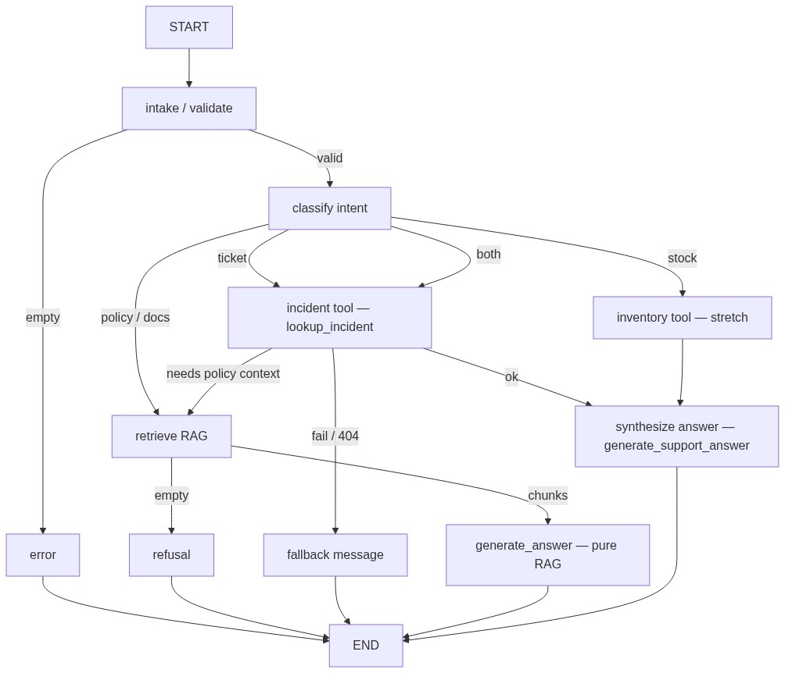
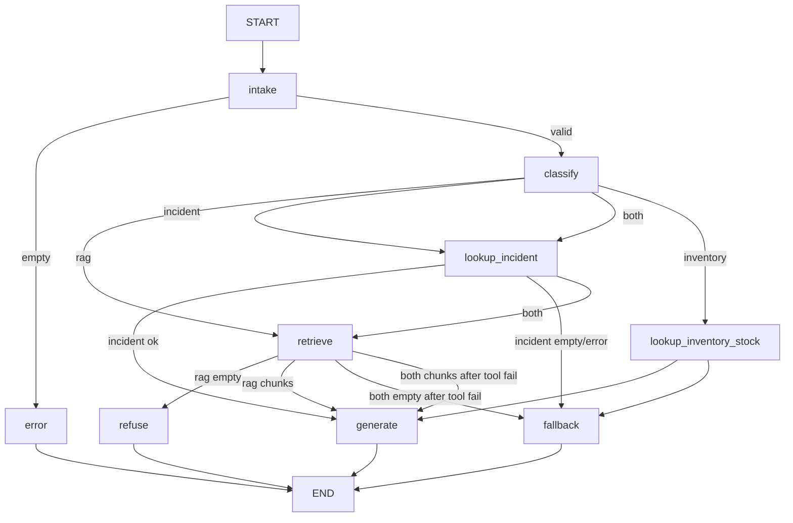

# Context 23 — Support Agent with LangGraph (Part 2)

**Ticket:** Support agent — live incident/inventory tools + auto-routing on the LangGraph from Part 1  
**Type:** Graph extension (classifier, tools, extended state, routing evals) — **same** `/agent/query` + `/support` UI  
**Branch:** `support-agent-langgraph-p2`  
**Status:** ✅ Implemented on branch `support-agent-langgraph-p2`  
**Depends on:** [context-23-support-agent-langgraph-p1.md](./context-23-support-agent-langgraph-p1.md) (**P1 merged** — PR #42), context-13 (incidents), context-11/12 (inventory), context-22 (routing)  
**Stakeholders:** Nicolás Park (tech lead); Brasaland Digital / operations support users

---

## Ticket brief (Part 2)

Part 1 made the reasoning flow **explicit and traceable** (intake → retrieve → generate/refuse). Part 2 adds **live operational data** so the agent can answer questions that the knowledge base alone cannot — open incidents, stock levels — with **automatic routing** between tools and RAG.

Tech lead intent:

> Before adding tools, the graph had to exist. Now extend it: classify the question, call real services when needed, time out gracefully, and keep every run traced. No simulated incident/inventory data in tools.

### Core acceptance criteria (non-negotiable)

1. **Rule-based classifier** runs **before** `retrieve` — routes to RAG-only, tool-only, or combined paths.
2. **Real HTTP tools** — incident lookup hits live `GET /incidents` (and optional detail); inventory stretch hits `GET /inventory/products` — **never** hard-coded fake rows in tool code.
3. **Forwarded auth** — tool HTTP calls reuse the caller’s bearer token (same user session as `/agent/query`).
4. **Timeout + fallback** — tool calls respect `AGENT_TOOL_TIMEOUT_SECONDS`; failures produce template fallbacks, not stack traces to client.
5. **Extended trace** — `trace_events` records classify decision, tool invocations, and RAG path (same server-side-only rule as P1).
6. **≥2 new routing evals** — tool path vs RAG path (mocked HTTP in CI).
7. **Client unchanged** — still `{ "question" }` → `{ "answer" }` only; no Part 2 fields in HTTP response.

---

## Prerequisite gate (Part 1)

Do **not** start Part 2 until Part 1 acceptance is complete:

- [x] LangGraph P1 merged: `services/api/agent/`, `/agent/query`, `/support` UI
- [x] RAG split: `generate_answer`, `assemble_context`, `refusal_message`
- [x] P1 evals green: `test_support_agent_graph.py`, `test_agent_api.py`, `test_rag.py`

---

## Locked decisions (P2-L1–P2-L44)

### Foundation (P2-L1–P2-L12)

| ID | Topic | Locked choice |
| -- | ----- | ------------- |
| **P2-L1** | Classifier | **Rule-based** `classify` node **before** `retrieve` (no LLM classifier in P2) |
| **P2-L2** | Intents | `rag` \| `incident` \| `inventory` \| `both` (string enum in state) |
| **P2-L3** | Incident tool transport | **HTTP** to bare FastAPI `GET /incidents` (and `GET /incidents/{id}` when ID detected) — not direct repository import from graph |
| **P2-L4** | Auth forwarding | Forward **`Authorization: Bearer`** from `/agent/query` request into tool HTTP client |
| **P2-L5** | Incident field naming | Use API field **`origin`** — **never** `source` (matches `IncidentResponse.origin`) |
| **P2-L6** | Tool timeout | **`AGENT_TOOL_TIMEOUT_SECONDS=5`** default; configurable via env |
| **P2-L7** | Tool failure | Template fallback answer + trace event `tool_error`; route may still hit RAG on `both` |
| **P2-L8** | `both` path | **Tool → retrieve → generate** — tool results feed generation context (with KB chunks) |
| **P2-L9** | Inventory tool | **Stretch optional** — `lookup_inventory_stock` via `GET /inventory/products` (+ `location_id` query when needed) |
| **P2-L10** | Separate tools | One tool function per domain (`lookup_incident`, optional `lookup_inventory_stock`) — no monolithic “do everything” tool |
| **P2-L11** | Manual E2E infra | **`DATABASE_URL` required** for live incidents/inventory; seed data via existing `npm run api:*-seed` |
| **P2-L12** | CI | **Mock HTTP** for tool calls in pytest — no Postgres/Qdrant required for routing evals |

### Classifier (P2-L13–P2-L22, P2-L44)

| ID | Topic | Locked choice |
| -- | ----- | ------------- |
| **P2-L13** | Default intent | `rag` when no incident, inventory, or `both` signals match |
| **P2-L14** | Intent priority | `both` > `incident` > `inventory` > `rag` (first applicable wins) |
| **P2-L15** | `both` (v1) | `both` when incident signals **and** KB/RAG signals — **not** incident+inventory alone |
| **P2-L16** | Incident signals | incident, ticket, case, complaint, report; status words; branch/origin enums; ID patterns `#N` / `incident N`; exclude generic issue/problem/help alone |
| **P2-L17** | KB/RAG signals | policy, manual, procedure, knowledge base, loyalty, points, tier, allergen, waste, supplier manual, training, handbook (alone → still `rag`; with incident → `both`) |
| **P2-L18** | Inventory signals | stock, inventory, sku, reorder, threshold, out of stock, current stock, minimum stock (stretch intent P2-L9) |
| **P2-L19** | Incident ID extraction | `\bincident\s+#?(\d+)\b`; else `\b#(\d+)\b` when incident signals present; detail GET skips list filters |
| **P2-L20** | Incident list filters (v1) | Extract `status`, `origin`, `branch` when no incident ID; **defer `category`** |
| **P2-L21** | Classify trace | Append `{node: classify, intent, matched, incident_id?, filters?}`; omit null/empty; no auth or question echo |
| **P2-L22** | Classify forbidden | No retrieve/generate/query, HTTP, LLM, tool_results/sources_used/answer; do not mutate question |
| **P2-L44** | Classify hints in state | `incident_id`, `incident_filters` on `AgentState`; set by classify, read by lookup_incident |

### Edge routing (P2-L23–P2-L29, P2-L42)

| ID | Topic | Locked choice |
| -- | ----- | ------------- |
| **P2-L23** | `rag` path | `classify → retrieve → generate \| refuse`; no tools; P1 empty-chunk refusal preserved |
| **P2-L24** | `incident` path | `classify → lookup_incident → generate \| fallback`; **never** `retrieve` |
| **P2-L25** | `both` happy path | `lookup_incident → retrieve → generate`; tool OK + empty RAG → generate from tool only (not refuse) |
| **P2-L26** | `both` + tool fail | Still `retrieve`; RAG ok → generate with caveat; RAG empty → fallback; trace `tool_error` |
| **P2-L27** | `incident` + empty list | `fallback` template; trace `row_count=0`; no retrieve/generate/refuse |
| **P2-L28** | `incident` + tool error | `fallback` immediately; trace `tool_error`; no retrieve; no retry v1 |
| **P2-L29** | `inventory` path (stretch) | Same as incident: `lookup_inventory → generate \| fallback`; never `retrieve` |
| **P2-L42** | lookup_incident edges | → `retrieve` **only** when `intent == both` |

### Fallbacks (P2-L30–P2-L34)

| ID | Topic | Locked choice |
| -- | ----- | ------------- |
| **P2-L30** | Fallback node | Dedicated `fallback` node for template answers; do **not** reuse `refuse` for tool failures |
| **P2-L31** | Fallback: timeout | “I couldn’t reach live incident data in time. Please try again in a moment, or check the Incidents tab in the backoffice directly.” (inventory variant for stretch) |
| **P2-L32** | Fallback: HTTP error | “Live incident lookup failed. Please try again shortly, or use the Incidents manager in the backoffice.” Trace reason `http_*`; no status in client response |
| **P2-L33** | Fallback: empty / not found | Empty list: “No incidents matched that query. Try an incident ID (e.g. incident 42) or narrow by status, branch, or origin.” 404 detail: “I couldn’t find incident {id}. Check the ID or browse open incidents in the Incidents manager.” |
| **P2-L34** | Fallback: both fail | “I couldn’t fetch live incidents, and I don’t have matching knowledge-base content for that question. Try again shortly, or check Incidents and Knowledge separately in the backoffice.” Reason `both_tool_and_rag_empty` |

### Generation, tools, auth (P2-L35–P2-L38)

| ID | Topic | Locked choice |
| -- | ----- | ------------- |
| **P2-L35** | Generation | New `generate_support_answer()` in `agent/generation.py` for tool/both; P1 `generate_answer()` unchanged for pure `rag` |
| **P2-L36** | `tool_results` schema | Envelope: `source`, `ok`, `http_status`, `rows[]`, `error?`, `reason?`, `filters?`; rows use `origin` not `source` |
| **P2-L37** | Auth forwarding | Bearer via invoke `configurable.auth_header`; **never** in AgentState, trace, or checkpoints |
| **P2-L38** | Tool HTTP client | `agent/tools/http.py` `fetch_json()`; mock in CI; base URL + timeout from env |

### Tests & delivery (P2-L39–P2-L43)

| ID | Topic | Locked choice |
| -- | ----- | ------------- |
| **P2-L39** | Routing eval #1 | Incident Q; mock `fetch_json`; assert no `retrieve`; trace classify→lookup_incident→generate; answer references tool data |
| **P2-L40** | Routing eval #2 | KB Q; mock retrieve+generate_answer; assert `fetch_json` never called; trace classify→retrieve→generate |
| **P2-L41** | P1 eval updates | Update `test_support_agent_graph.py` for `classify` in trace; intake→error skips classify |
| **P2-L43** | Phase plan | P2-0 doc → P2-1 classify/graph → P2-2 tools → P2-3 generation → P2-4 evals → P2-5 stretch+ops |

### Routing alignment (context-22 — unchanged from P1)

| Layer | Path |
| ----- | ---- |
| Backoffice page | `/support` |
| Browser API | `/api/agent/query` |
| FastAPI mount | `/agent` → `POST /agent/query` |
| Incident tool target (server-side) | `http://127.0.0.1:8000/incidents` (or `AGENT_INTERNAL_API_BASE_URL`) — **not** `/api/incidents` from Python |

Tools run **inside the API process** but call incidents/inventory as **HTTP** to keep the same auth and validation stack as manual API use.

---

## Classifier example table (v1)

| Question | Intent | Notes |
| -------- | ------ | ----- |
| “How many points for Gold tier?” | `rag` | KB only |
| “List open incidents” | `incident` | Status + incident noun |
| “What is incident 42?” | `incident` | ID → detail GET |
| “Open incidents at Miami Doral” | `incident` | Branch filter |
| “Current stock for SKU BEEF-001” | `inventory` | stretch |
| “Open incidents and our waste disposal policy” | `both` | incident + KB |
| “Stock levels and open tickets” | `incident` | incident > inventory; not `both` (no KB) |

---

## Extended graph state (Part 2)

Add to `AgentState` (keep all Part 1 fields):

```python
intent: str                         # rag | incident | inventory | both
incident_id: int | None             # set by classify; read by lookup_incident
incident_filters: dict[str, str]    # status, origin, branch (v1)
sources_used: list[str]             # e.g. ["incidents_api", "rag"]
tool_results: list[dict]            # normalized envelopes (P2-L36)
```

**Still excluded from HTTP:** `thread_id`, chat `messages[]`, raw tool JSON, bearer token.

---

## Graph nodes and edges (Part 2 delta)

### New / updated nodes

| Node | Responsibility |
| ---- | -------------- |
| `classify` | Rule-based intent + hints (`incident_id`, `incident_filters`); P2-L13–L22 |
| `lookup_incident` | HTTP GET `/incidents` or `/incidents/{id}`; populate `tool_results` |
| `lookup_inventory_stock` | *(stretch)* HTTP GET `/inventory/products` or `.../{product_id}` |
| `fallback` | Template answers for tool empty/error/timeout; P2-L30–L34 |
| `generate` | P1 `generate_answer()` for pure `rag`; `generate_support_answer()` for tool/both |

Context synthesis for tool + RAG lives in `agent/generation.py` (`generate_support_answer`) — not a separate graph node.

Part 1 nodes **`intake`**, **`retrieve`**, **`refuse`**, **`error`** remain — extend edges only.

### Edge routing table (locked)

| Intent | Sequence | `retrieve`? |
| ------ | -------- | ----------- |
| `rag` | `intake → classify → retrieve → generate \| refuse` | Always |
| `incident` | `intake → classify → lookup_incident → generate \| fallback` | **Never** |
| `both` (tool OK) | `intake → classify → lookup_incident → retrieve → generate` | After tool |
| `both` (tool fail) | `lookup_incident → retrieve → generate \| fallback` | Yes (P2-L26) |
| `inventory` *(stretch)* | `intake → classify → lookup_inventory → generate \| fallback` | **Never** |

**`intake → error`** (empty question) skips `classify` — unchanged from P1.

**`both` sub-rules:**

| Tool outcome | RAG outcome | Route |
| ------------ | ----------- | ----- |
| OK | Chunks found | `generate` (tool + RAG via `generate_support_answer`) |
| OK | Empty | `generate` (tool context only — not `refuse`) |
| Error/timeout | Chunks found | `generate` (RAG + caveat) |
| Error/timeout | Empty | `fallback` (P2-L34) |

**Must preserve P1 refusal** when RAG empty on **`rag`-only** path only (P2-L23).

### Flow diagram



<details>
<summary>Mermaid source</summary>



</details>

---

## Tool contracts

### `lookup_incident`

- **Input:** `incident_id`, `incident_filters` from state; auth via `configurable.auth_header`
- **HTTP:** `GET {API_BASE}/incidents/{id}` when `incident_id` set (skip list filters)
- **HTTP:** `GET {API_BASE}/incidents` with `status`, `origin`, `branch` when no ID (v1; category deferred)
- **Output:** P2-L36 envelope in `tool_results`; append `incidents_api` to `sources_used` on success
- **Must not:** Import `incidents.repository` directly from graph nodes

### `lookup_inventory_stock` (stretch)

- **HTTP:** `GET {API_BASE}/inventory/products` or `GET .../products/{product_id}?location_id=N`
- **Output:** SKU, `current_stock`, `min_stock_threshold`, location context in `tool_results`
- **Seed:** `npm run api:inventory-seed` for manual demos

### `tool_results` envelope (P2-L36)

```python
{
    "source": "incidents_api",       # or "inventory_api"
    "ok": True,
    "http_status": 200,
    "filters": {"status": "open", "branch": "miami_doral"},  # optional
    "incident_id": None,              # set when detail GET
    "rows": [
        {
            "id": 12,
            "title": "...",
            "status": "open",
            "origin": "internal",     # P2-L5: never "source"
            "branch": "miami_doral",
            "category": "equipment_failure",
        }
    ],
    "error": None,
    "reason": None,                   # "timeout" | "http_404" | "empty" | ...
}
```

### Generation with tools (P2-L35)

| Path | Generator |
| ---- | --------- |
| Pure `rag` (chunks present) | `generate_answer(question, assemble_context(chunks))` — unchanged |
| `incident` / `inventory` (tool ok) | `generate_support_answer(question, tool_results=..., rag_context="")` |
| `both` (tool ok) | `generate_support_answer(question, tool_results=..., rag_context=...)` |
| `both` (tool fail, RAG ok) | `generate_support_answer(..., caveat="Couldn't fetch live incidents.")` |

- Build combined context: `## Live operational data` + optional `## Knowledge base`
- **Do not** call monolithic `query()` in any node
- **Do not** loosen P1 `generate_answer()` — Knowledge API stays unchanged

---

## File layout (suggested)

| Responsibility | Location |
| -------------- | -------- |
| Classifier rules | `services/api/agent/classify.py` |
| Tool HTTP wrapper | `services/api/agent/tools/http.py` |
| Tool HTTP clients | `services/api/agent/tools/incidents.py`, `.../inventory.py` |
| Fallback templates | `services/api/agent/fallbacks.py` |
| Tool/both generation | `services/api/agent/generation.py` |
| Graph updates | `services/api/agent/graph.py`, `state.py` |
| Route auth pass-through | `services/api/agent/routes.py` — read `Authorization`, pass via invoke config |
| P2 routing evals | `services/api/tests/pipelines/test_support_agent_routing.py` |
| P1 eval updates | `services/api/tests/pipelines/test_support_agent_graph.py` |

---

## Phase plan (implement in order — P2-L43)

| Phase | Work | Gate |
| ----- | ---- | ---- |
| **P2-0** | Doc locks P2-L13–P2-L44 | Spec review (this file) |
| **P2-1** | `state.py` + `classify.py` + graph skeleton (stub tool nodes) | Classify unit tests |
| **P2-2** | Auth config + `tools/http.py` + `tools/incidents.py` + `fallback` node | Manual curl with token |
| **P2-3** | `generation.py` + wire `generate` paths | Incident E2E |
| **P2-4** | `test_support_agent_routing.py` + P1 eval updates (P2-L41) | Full pytest gate |
| **P2-5** | `.env.example`, inventory stretch (P2-L9), doc status → Implemented | P2 verification commands |

---

## Environment (add to `.env.example` on P2 branch)

```bash
# --- Agent tools (context-23 Part 2) ---
AGENT_TOOL_TIMEOUT_SECONDS=5
# Base URL for in-process tool HTTP (default: http://127.0.0.1:8000)
AGENT_INTERNAL_API_BASE_URL=http://127.0.0.1:8000
```

Part 1 vars unchanged (`AGENT_CHECKPOINT_DB_PATH`, RAG vars, `NEXT_PUBLIC_AGENT_API_BASE_URL`).

---

## Ticket evaluation criteria (rubric)

External ticket/course checklist — **same bar** as Core acceptance criteria and P2-L1–P2-L44 above. Use this section to **sign off the branch** (not a separate pytest target).

| # | Criterion | P2 doc mapping | Branch evidence |
| - | --------- | -------------- | --------------- |
| 1 | The **incident tool** has a typed input/output contract and queries the **real incident manager service** (HTTP `GET /incidents`, not fake rows or direct repository import) | P2-L3, P2-L36, Tool contracts § `lookup_incident` | `agent/tools/incidents.py`; `test_incidents_tool.py`; manual curl — open incidents |
| 2 | There is an **explicit timeout** on tool HTTP calls | P2-L6, P2-L38 | `agent/tools/http.py`; `AGENT_TOOL_TIMEOUT_SECONDS`; timeout cases in `test_incidents_tool.py`, `test_inventory_tool.py` |
| 3 | There is a **verifiable fallback path** when the tool fails or the resource doesn’t exist — **no made-up answers** (template fallbacks, dedicated `fallback` node) | P2-L7, P2-L30–P2-L34 | `agent/fallbacks.py`, `fallback` node; `test_support_agent_graph.py` (empty incident list → fallback) |
| 4 | The agent **routes correctly** between RAG and tool(s) from question context — no explicit user routing instructions | P2-L1, P2-L13–L22, P2-L23–L29 | `agent/classify.py`, graph edges; `test_classify.py`, `test_support_agent_routing.py`; manual curls (incident vs Gold tier) |
| 5 | Each tool has **single responsibility** (incident tool ≠ inventory tool; no monolithic tool) | P2-L10 | `agent/tools/incidents.py` vs `agent/tools/inventory.py`; separate graph nodes |
| 6 | Each run’s **trace** shows which source(s) were used and in what order (server-side only) | Core #5, P2-L21 | `trace_events`, `sources_used` in graph; routing/graph evals; API logs on manual runs |
| 7 | **≥2 new evals** verifying correct routing between RAG and tool | P2-L39, P2-L40 | `test_support_agent_routing.py` (evals #1–#2) |
| 8 | *(Stretch)* Inventory tool follows the same contract, timeout, and fallback rules | P2-L9, P2-L29 | `agent/tools/inventory.py`; `test_inventory_tool.py`; routing eval #3; manual curl — SKU BEEF-001 |

### Rubric (verbatim)

- The ticket tool has a typed input/output contract and queries the real incident manager service
- There is an explicit timeout on the tool call
- There is a verifiable fallback path when the tool fails or the resource doesn’t exist — no made-up answers
- The agent routes correctly between RAG and the tool(s) based on the question’s context, without explicit user instructions
- Each tool has a single responsibility (no tool combines tickets and inventory)
- Each run’s trace makes it possible to tell which source(s) were used and in what order
- There are at least 2 new evals verifying correct routing between RAG and tool
- *(Stretch)* the inventory tool, if implemented, follows the same contract, timeout, and fallback rules

---

## Evaluation requirements (Part 2)

Add **≥2 routing evals** in `test_support_agent_routing.py` (mocked tool HTTP):

| # | Input (example) | Assert |
| - | --------------- | ------ |
| 1 | “List open incidents at Miami Doral” (mock `fetch_json` → rows) | Trace: `classify` → `lookup_incident` → `generate`; **`retrieve` not in trace**; `intent == incident`; answer references incident data |
| 2 | “How many points for Gold tier?” (mock retrieve → chunks) | Trace: `classify` → `retrieve` → `generate`; **`fetch_json` never called**; `intent == rag` |
| 3 | *(optional)* “List open incidents at Miami Doral” (mock `fetch_json` → timeout) | Trace: `classify` → `lookup_incident` → `fallback`; no `retrieve`/`generate`; template fallback answer |
| 4 | *(stretch)* “Current stock for SKU BEEF-001” | Trace includes `lookup_inventory_stock` |

**P1 regression (P2-L41):** Update `test_support_agent_graph.py` — add `classify` to trace for valid questions; intake→error skips classify; all P1 behavioral guarantees unchanged.

Keep all **Part 1 evals** green after graph changes.

---

## Prerequisites

### Manual E2E (Part 2)

| Service | Required |
| ------- | -------- |
| FastAPI | Yes |
| **`DATABASE_URL`** (Postgres) | **Yes** — incidents + inventory |
| Seeded incidents/inventory | Yes (`api:incidents-seed`, `api:inventory-seed`) |
| Qdrant + RAG env | Yes for `rag` / `both` paths |
| Backoffice login | Yes |

### CI

- Mock `agent/tools/http.fetch_json` — no live Postgres required for routing unit evals.

---

## Explicit non-goals (Part 2)

- Replacing Part 1 graph or removing P1 nodes
- LLM-based intent classifier (deferred)
- Returning trace, tools, or chunks to HTTP client
- Celery/async agent runs
- New backoffice page (stay on `/support`)
- LangChain tool abstractions wrapping RAG
- Persisting bearer tokens in checkpoint state

---

## Verification commands (Part 2 gate)

```bash
# Part 1 regression (must stay green)
cd services/api && uv run python -m pytest \
  tests/pipelines/test_rag.py \
  tests/pipelines/test_support_agent_graph.py \
  tests/test_agent_api.py -q

# Part 2 routing evals (after implementation)
cd services/api && uv run python -m pytest tests/pipelines/test_support_agent_routing.py -q
```

---

## Part 1 companion

Full Part 1 implementation detail: [context-23-support-agent-langgraph-p1.md](./context-23-support-agent-langgraph-p1.md)

---

_Internal document — Brasaland · Context 23 Part 2 · Support Agent tools + routing_
